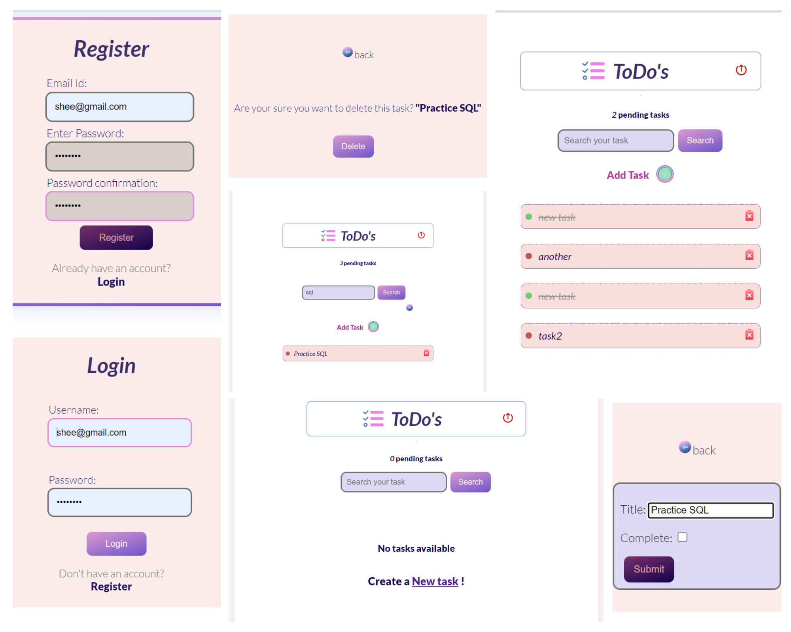

# Todo App



This is a simple Todo App built using Django framework and sqlite3 database
It allows users to manage their tasks with the following features:

- User Registration: Users can sign up for an account.
- User Login: Registered users can log in to their accounts.
- Add New Task: Users can create new tasks to keep track of their todos.
- Mark as Completed: Users can mark tasks as completed when they are done.
- Update and Delete: Users can edit or delete tasks as needed.
- Logout: Users can log out of their accounts securely.

## Technologies Used

- **Django**: The web application framework used for building the app.
- **Python**: The programming language used for the backend logic.
- **sqlite3**: used for data storage and retrieval.

## Getting Started

To run this application locally, follow these steps:

1. Clone this repository to your local machine:

   ```bash
   git clone https://github.com/sheenam-waris/todo-app-django.git

2. Create a virtual environment (optional but recommended):

   ```bash
   python -m venv venv
    ```

3. Activate the virtual environment:
    * On Windows:
    ```bash
        venv\Scripts\activate
    ```
    * On macOS and Linux:
    ```bash
        source venv/bin/activate
    ```
4. Install the project dependencies:
    ```bash
    pip install -r requirements.txt

    ```
5. Migrate database:
    ```bash
        python manage.py makemigrations todoApp
        python manage.py migrate
    ```

6. Run the application:
    ```bash
    python manage.py runserver
    ```

Open your web browser and navigate to http://localhost:8000 to use the Todo App.